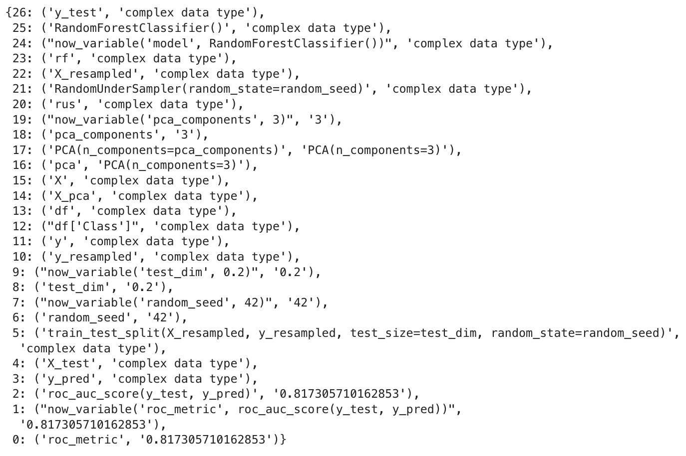
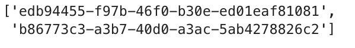
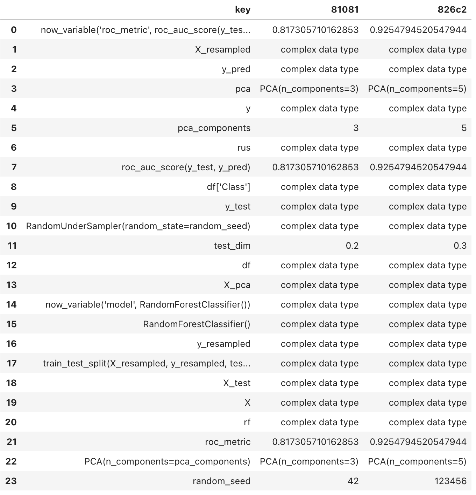
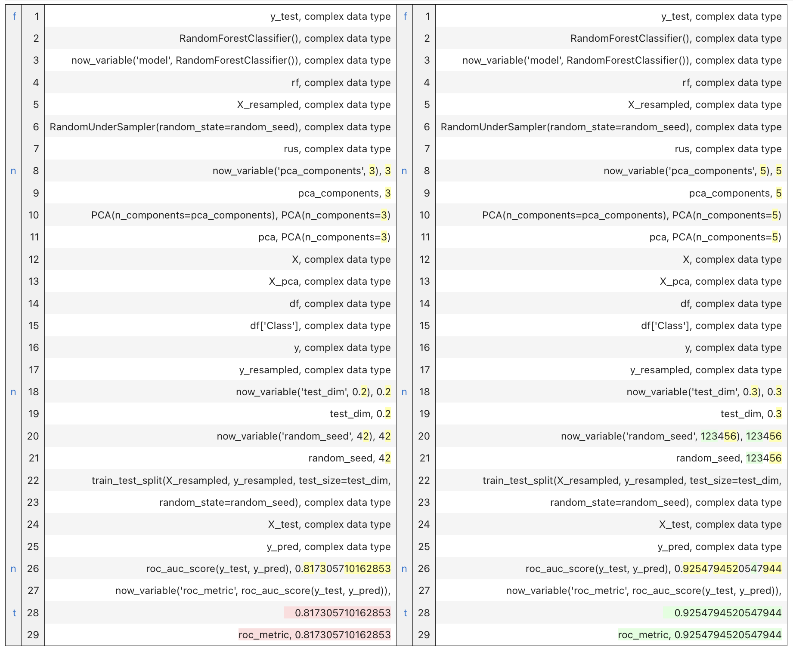
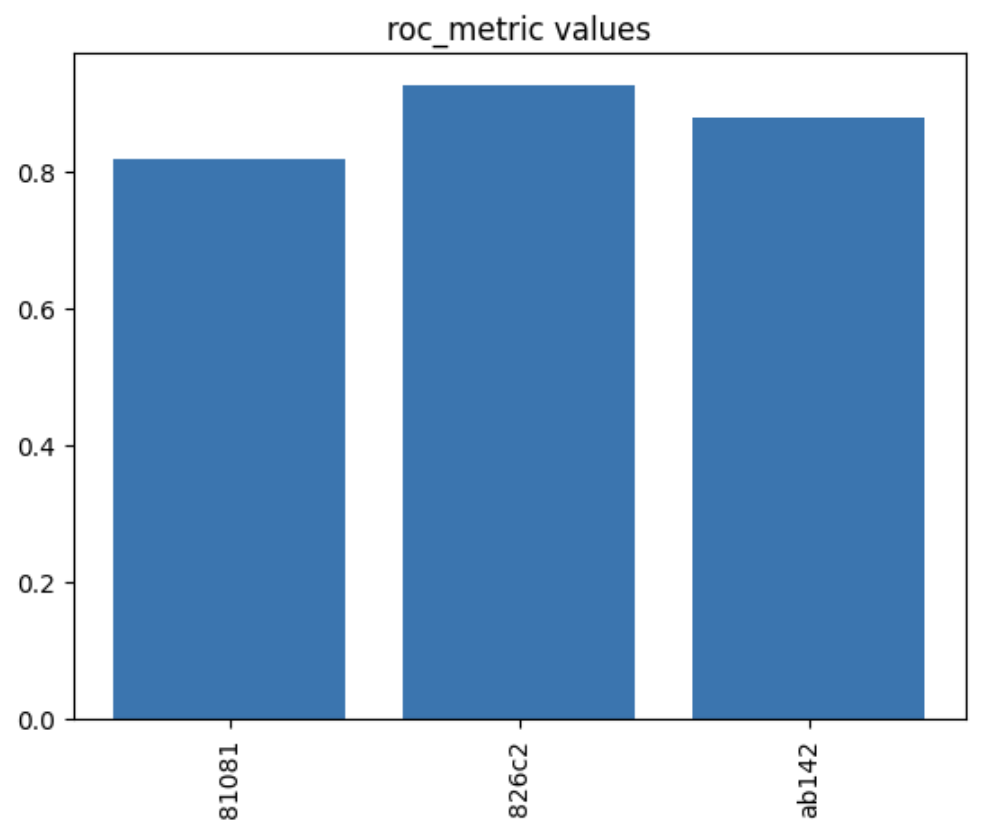
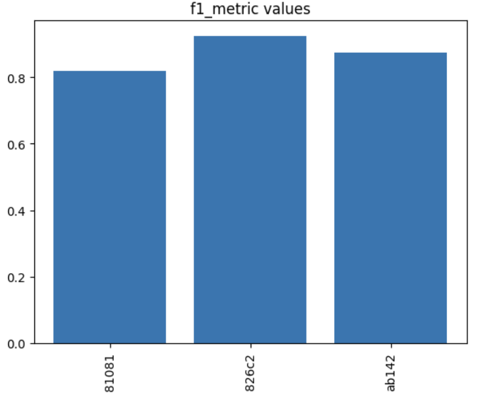
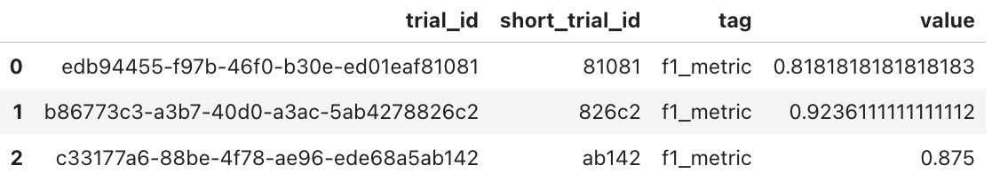
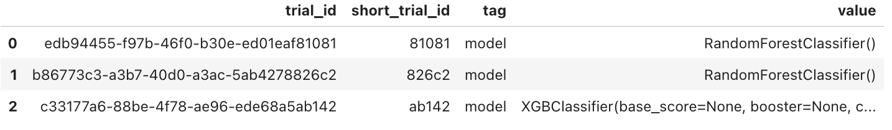

# Provenance of Machine Learning experiments with noWorkflow

In many teams doing Data Science and Machine Learning at the academy and industry, we frequently find ourselves starting experiments with minimal structure, basic setups, and a multitude of hypotheses. This initial stage is all about exploration, where our primary goal is to validate if our hypothesis holds on.

However, as these experiments progress, they quickly grow in complexity and its management becomes a nightmare. Reproducing a specific trial with its unique setup becomes cumbersome, and juggling multiple trials can seem next to impossible.

In this blog post, we introduce you to the noWorkflow package, with exciting features born out of the Summer of Reproducibility project in 2023. We'll illustrate its capabilities with a practical use case, shedding light on how it can streamline your workflow.

You can find the code on our GitHUb repository.

## noWorkflow

According with the noWorkflow developers team:

```The noWorkflow package project aims at allowing scientists to benefit from provenance data analysis even when they don't use a workflow system...```

At the start, noWorkflow looked like a very interesting tool to add to an analytics stack. Neat speaking, noWorkflow provides:

* Command-line accessibility
* Seamless integration with Jupyter Notebooks
* Minimal setup requirements in your environment
* Elimination of the need for virtual machines or containers in its setup
* Workflow-free operation
* Open source
* Framework agnostic

On top of that, in the OSPO Summer of Reproducibiltiy Program, we added additional features to enhance DS/ML experiment reproducibility. In this regard, we introduced:

* The ability to tag variables of interest, allowing researchers to track all operations related to a specific variable's value
* A feature to display dependencies of tagged variables
* Tools for comparing the history of a tagged variable between two trials
* The option to retrieve the values of a tagged variable across all trials within an experiment
* A bonus: Achieving all of this with minimal intrusive code added to your notebook

To showcase how this features can take your experiment management to another level, we have chosen classical problema in Fraud Detection as a Machine Learning application to test the noWorkflow.

## Tutorial Setup

To perform this tutorial, we highly recommend setting up a Conda environment on your system, which involves installing the noWorkflow package and Jupyter Lab. To reproduce the available experimental Notebooks, you can clone this repository as well. Take advantage of the requirements.txt file to accelerate your setup with pip tools.

To create a new Conda environment, run the following commands:

```bash
# Create a conda env
conda create -n noworkflow python=3.7
conda activate noworkflow
pip install -r requirements.txt

# install noworkflow version 2.0.0
git clone https://github.com/gems-uff/noworkflow.git
cd noworkflow/capture
python setup.py install

pip install jupyter==1.0.0
jupyter nbextension install --py --sys-prefix noworkflow
jupyter nbextension enable noworkflow --py --sys-prefix

# install noworkflow jupyter kernel
now kernel
```

Then, clone our usecase tutorial in your local machine:

```bash
git clone https://github.com/jaglima/noworkflow_usecase.git

```

In the noworkflow_usecase directory, you will find the dataset directory and five Notebooks. [Notebook 1](now_usecase_part_1.ipynb) and [Notebook 2](now_usecase_part_2.ipynb) are two different trials of a Fraud Detection experiment. [Notebook 3](now_usecase_part_3.ipynb) wraps up a comparision between trials 1 and 2. [Notebook 4](now_usecase_part_4.ipynb) is another trial in a different approach. [Notebook 5](now_usecase_part_5.ipynb) is comparision between trials 1 and 4.

## Fraud Detection use case

Fraud detection is a typical use case…

in this setup, we select the noWorkflow kernel and run the following code:

```python
df = pd.read_csv('dataset/creditcard.csv', encoding='utf-8')
X = df.drop('Class', axis=1)
y = df['Class']

# Here we are stamping pca_components as a now_variable, and started 
# monitoring it
pca_components = now_variable('pca_components', 3)
pca = PCA(n_components=pca_components)
X_pca = pca.fit_transform(X)

# Same here with random_seed
random_seed = now_variable('random_seed', 42)
rus = RandomUnderSampler(random_state=random_seed)
X_resampled, y_resampled = rus.fit_resample(X_pca, y)

# Same with test_dim
test_dim = now_variable('test_dim', 0.2)
X_train, X_test, y_train, y_test = train_test_split(X_resampled, y_resampled, test_size=test_dim, random_state=random_seed)

# Keeping the model type 
rf = now_variable('model', RandomForestClassifier())
rf.fit(X_train, y_train)
y_pred = rf.predict(X_test)

# Finally, keeping the metrics roc and f1
roc_metric = now_variable('roc_metric', roc_auc_score(y_test, y_pred))
f1_metric = now_variable('f1_metric', f1_score(y_test, y_pred))

print("Random Forest - ROC = %f, F1 = %f" % (roc_metric, f1_metric))
```

After running this snippet, with our parameters rightly tagged, we have our first trial. Other trials can be generated by changing hyperparameters, feature transformations, models and metrics under the choice of researcher. 

## NoWorkflow at the spotlight

When calling the backward_deps('tagged_var_name'), 
we receive a list of variables that are utilized in the computation of the tagged variable. In this instance, when you call it with the 'roc_metric' tag, the output will include all operations that were involved in the construction of its ultimate value.


```python
dict_ops = backward_deps('roc_metric', False)
```


the output is a Python dictionary format, with all the operations in order that they were executed. At the end of the list, we have the operation that generated the final value, a ROC value of 0.81.

To preserve these outputs for future comparisons with additional trials, you can save it by calling:

``` python
trial_id = __noworkflow__.trial_id
store_operations(trial_id, dict_ops)
```

The list of currently stored trials can be obtained by:

```python
resume_trials()
```



## Experiment comparision


Suppose now that we have run a second trial with a different set of parameters. It is already done in the usecase notebook here. Neverthless, we encourage the reader to rerun the previous snippets tweaking some of hyperparameters to see the impact.  By doing so, we will be able to compare the outcomes of both trials using two trial_intersection_diff() and the trialdiff(). Lets see them.

```python   
trial_intersection_diff(list_id[0], list_id[-1])
```


In the previous output, you'll notice that 'pca_components' has been modified from 3 to 5, and the 'test_dim' size has increased from 0.2 to 0.3. However, please be aware that the vectors, matrices and complex types like 'y_test' and 'y_pred,' are currently not available for inspection. We acknowledge this limitation and addressing it in our backlog.

When running trial_diff(), the function displays the values of variables and function calls in a diff file format, highlighting the sequence of operations performed. The objective is to identify any differences that occurred between the two trials.

``` python
trial_diff(list_id[0], list_id[-1])
```



In this case, we can easily spot the differences in the 'pca_components' and 'test_dim' provenance and differences in their results. 

## Tagged multi trials plots

In a broader perspective, noWorkflow has implemented a multi trials displaying feature, where we can easily inspect the values of tags across multiple trials. This feature is particularly useful when assessing the control variables behavior among the different trials and is a first step in facilitating cross comparisions between fatures and results in multi-trial experiments.

In the current implementation of noWorkflow, any tagged variable can be inspected in a multi trials plot, just by calling:

```python
var_tag_plot('roc_metric')
```


in this case, we can see that the best roc_metric was achieved in the experiment trial nicknamed 826c2. 

In the same maner, we can examine the f1_metric, that confirms the best performance was achieved in the trial 826c2.
```python
var_tag_plot('f1_metric')
```



in this case, we can see that the best roc_metric was achieved in the experiment trial nicknamed 826c2. 

Another feature is a general purpose  plot, that can be used to inspect any tagged variable. The user can also retrive a pandas DataFrame with the values in order to make their own plots of further analysis. In this case, the trial_id, a nickname, the tag name and value are returned:

```python
var_tag_values('f1_metric')
```



```python
var_tag_values('model')
```




### Cleaninig notebooks

Another very interesting feature of noWorkflow is the ability to clean notebooks. This feature is very useful when you are working with different experiments in a single notebook. Recurring to the command line, a researcher can obtain a notebook cleaned of any cells that doesn't relates with a specific cell. The way of doing it in command line is:

```python
now clean 9 -i bla.ipynb final.ipynb
```
Where 9 is the number of cell that contains the target value that we want to keep...

### Final words

In this short tutorial, we have seen how to use the noWorkflow to improve the management of experiments in DS and ML in its early stages. 

We would like to thanks the  OSPO Summer of Reproducibility organization and the noWorkflow core team for this opportunity in contribute with the Open Source community. We encourage the reader to give noWorkflow a try and become an active contributor to the growing community. Your feedback and experiences will not only improve the tool but also contribute to a more transparent and collaborative future in tech. Together, we can make strides toward achieving greater reproducibility and innovation in our work. 
Thank you for joining us on this journey, and we look forward to your valuable contributions.